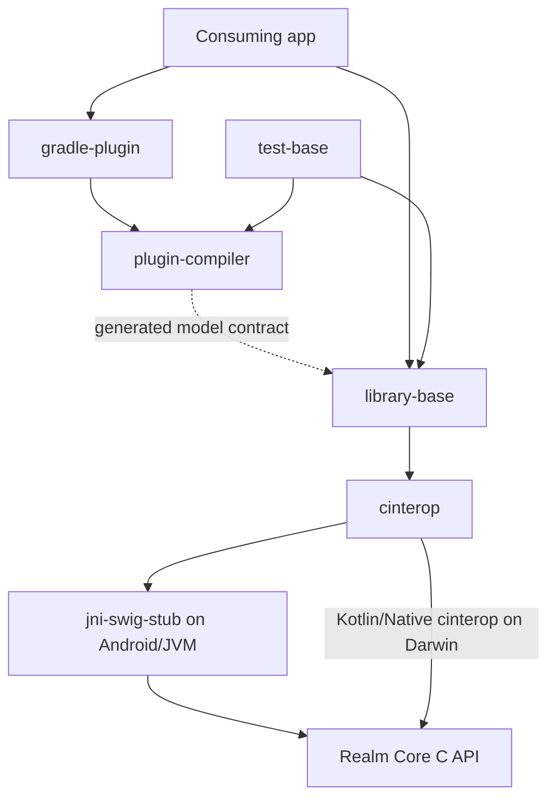

# Repository map

## Build roots and top-level directories

The repository contains several independent Gradle builds. The SDK modules belong to
[`packages/settings.gradle.kts`](../../packages/settings.gradle.kts); the root
[`settings.gradle.kts`](../../settings.gradle.kts) does not include them as normal subprojects.

| Path | Responsibility |
| --- | --- |
| `packages/` | SDK, native bindings, compiler/Gradle plugins and shared SDK tests |
| `buildSrc/` | Shared versions, `realm-publisher` and `realm-lint` plugins |
| `config/` | Static analysis configuration |
| `integration-tests/gradle/` | Separate consuming projects for Gradle/plugin compatibility |
| `examples/min-android-sample/` | Small Android consumer |
| `examples/kmm-sample/` | Multiplatform consumer and platform applications |
| `examples/realm-java-compatibility/` | Realm Java/Kotlin file-compatibility example |
| `benchmarks/` | Shared, Android and JVM benchmark projects |
| `.github/workflows/` | Inherited multi-platform build, test and publication automation |
| `tools/` | Release, artifact and maintenance scripts; inspect side effects before running |
| `docs/guides/` | Application-facing usage documentation |
| `docs/maintainers/` | This map and implementation/maintenance guides |

`packages/buildSrc`, `benchmarks/buildSrc` and several example `buildSrc` entries are symlinks to the
shared build logic. Modify the target once; do not replace the links with copied directories.

## SDK modules

| Module | Role | Principal inputs and entry points |
| --- | --- | --- |
| [`library-base`](../../packages/library-base) | Public Kotlin API and object-store runtime | `src/commonMain/kotlin/io/realm/kotlin/Realm.kt`, `RealmConfiguration.kt`, `internal/` |
| [`cinterop`](../../packages/cinterop) | Platform bindings, native pointer/value handling, callbacks and Core compilation | `src/commonMain/.../interop/RealmInterop.kt`, JVM/Darwin actuals, `src/jvm/CMakeLists.txt` |
| [`jni-swig-stub`](../../packages/jni-swig-stub) | Generated JVM-to-C API wrapper | `realm.i`, `src/main/jni/`, `realmWrapperJvm` task |
| [`plugin-compiler`](../../packages/plugin-compiler) | Model/schema/accessor code generation | `src/main/kotlin/io/realm/kotlin/compiler/Registrar.kt` |
| [`plugin-compiler-shaded`](../../packages/plugin-compiler-shaded) | Alternate packaged compiler artifact used by Native test configuration | `build.gradle.kts`, dependency on `plugin-compiler` |
| [`gradle-plugin`](../../packages/gradle-plugin) | Consumer plugin and compiler artifact selection | `RealmPlugin.kt`, `RealmCompilerSubplugin.kt` under `src/main/kotlin/io/realm/kotlin/gradle/` |
| [`test-base`](../../packages/test-base) | Shared behavior, compiler and platform tests | `src/commonTest`, `src/jvmTest`, `src/androidInstrumentedTest` |
| `external/core` | Pinned Realm Core submodule; the storage engine | Gitlink and [`.gitmodules`](../../.gitmodules) |

There is no `library-sync` or `test-sync` module in `community`. Some comments, properties and native
build flags still mention Sync; their presence does not restore the removed Kotlin Sync API.

## Dependency directions

This separates compile-time generation from runtime access. The compiler also has build dependencies
on `cinterop`, and its tests use `library-base`; the diagram is not a complete Gradle dependency graph.

## Multiplatform layout

For `library-base`, shared public behavior lives in `commonMain`. The intermediate `jvm` source set
is shared by `androidMain` and `jvmMain`; code under `jvm` therefore affects Android as well as desktop
JVM. `nativeDarwin` feeds `nativeMacos` and `nativeIos`, which feed the architecture-specific targets.
The [module build script](../../packages/library-base/build.gradle.kts) defines the actual edges.

`cinterop` follows the same broad split: common declarations, Android/JVM bindings, and Darwin
bindings. Platform source sets are not interchangeable; Java reflection fixes do not automatically
apply to Kotlin/Native companion discovery.

## Where to investigate a failure

| Symptom | Read first |
| --- | --- |
| Compiler `NoSuchMethodError`, invalid IR or recursive model compilation | Compiler guide; `IrUtils.kt`, FIR model extensions, IR lowering |
| Valid model rejected as unprocessed | Runtime companion lookup, generated companion and plugin application |
| Wrong field values or persisted names | Generated accessors/schema, `RealmObjectHelper`, schema metadata |
| Stale reads, missed notifications, thread violation | `RealmImpl`, `LiveRealm`, `SuspendableWriter`, `SuspendableNotifier` |
| `UnsatisfiedLinkError`, JNI crash or missing native symbol | `RealmInitializer`, `SoLoader`, SWIG inputs, packaged native libraries |
| File-open, encryption or migration failure | Configuration mapping, `RealmInterop`, Core revision and fixture compatibility |
| Gradle plugin resolves wrong SDK version | `Config.kt`, hard-coded coordinates, generated version constants and published metadata |

## Generated versus maintained files

Maintained inputs include `realm.i`, native helper sources, Kotlin source, Gradle scripts and compiler
test `input`/`expected` fixtures. Generated outputs include:

- `jni-swig-stub/build/generated/sources/java` and `.../jni/realmc.cpp`;
- `gradle-plugin/build/generated/source/version` and `cinterop`'s generated SDK version source;
- module `build/` native libraries, class files, reports and test Maven repository;
- compiler test resource `output` directories. Expected IR snapshots are reviewed test fixtures.

Do not fix generated output directly: it will be overwritten and will not repair a clean build.
