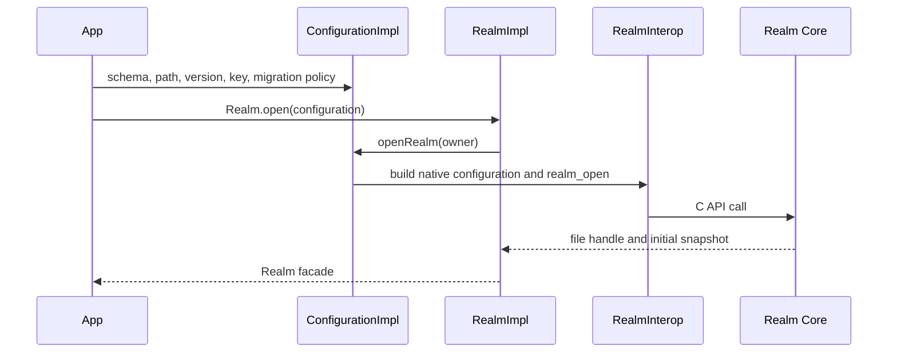

# Runtime: from a Kotlin object to a Realm file

## Public entry points and the generated contract

The public API starts in [`Realm.kt`](../../packages/library-base/src/commonMain/kotlin/io/realm/kotlin/Realm.kt),
[`RealmConfiguration.kt`](../../packages/library-base/src/commonMain/kotlin/io/realm/kotlin/RealmConfiguration.kt)
and the `types`, `query`, `notifications`, `schema`, `migration` and `ext` packages beside them.
Applications declare classes implementing `RealmObject` or `EmbeddedRealmObject`; the
[compiler plugin](compiler.md) supplies the extra runtime contract.

An unmanaged model uses ordinary Kotlin storage. A managed model has a `RealmObjectReference`
identifying the object, owning Realm/version and schema metadata. Generated property accessors choose
between ordinary fields and `RealmObjectHelper` calls into the native object. Generated companions
supply schema metadata and object construction through `RealmObjectCompanion` and the `Mediator`.

The JVM companion lookup is in
[`platform/RealmObject.kt`](../../packages/library-base/src/jvm/kotlin/io/realm/kotlin/internal/platform/RealmObject.kt).
This community baseline uses Kotlin's `companionObjectInstance`; it does not contain Infomaniak's
restricted `$Companion`/`$CREATOR` lookup. Preserve named-companion support during optimization.

## Opening a file

[`ConfigurationImpl.kt`](../../packages/library-base/src/commonMain/kotlin/io/realm/kotlin/internal/ConfigurationImpl.kt)
resolves model companions, constructs the native schema/configuration, passes encryption and migration
settings and opens a native Realm. [`RealmImpl.kt`](../../packages/library-base/src/commonMain/kotlin/io/realm/kotlin/internal/RealmImpl.kt)
coordinates initial data, the initial frozen reference, writer and notification contexts.
`RealmConfigurationImpl` holds local-Realm-specific policy.

Debug open failures at the configuration boundary before changing the storage engine. A schema/model
error, incorrect key and native file-format problem have different causes. Avoid deleting a file to
make an interoperability test pass.

## Reads, snapshots and object lifetime

The public Realm facade selects a recent frozen reference from its initial open, writer and notifier.
This does not mean every previously obtained object updates in place. Object/results wrappers keep
their owning version, and long-lived references can retain versions and grow resource use.

- [`RealmReference.kt`](../../packages/library-base/src/commonMain/kotlin/io/realm/kotlin/internal/RealmReference.kt)
  defines live/frozen reference ownership and snapshot creation.
- [`LiveRealm.kt`](../../packages/library-base/src/commonMain/kotlin/io/realm/kotlin/internal/LiveRealm.kt)
  owns thread-confined native state and produces frozen snapshots.
- [`RealmObjectReference.kt`](../../packages/library-base/src/commonMain/kotlin/io/realm/kotlin/internal/RealmObjectReference.kt)
  implements object validity, freeze/thaw and notification registration.
- [`RealmResultsImpl.kt`](../../packages/library-base/src/commonMain/kotlin/io/realm/kotlin/internal/RealmResultsImpl.kt)
  wraps query results; `VersionTracker` tracks retained frozen references.

When editing ownership or lifetime code, review close behavior, deleted objects and retained versions.
Do not share mutable native pointers across dispatchers or create competing owners for one pointer.

## Writes and notifications

`RealmImpl.write` delegates to
[`SuspendableWriter`](../../packages/library-base/src/commonMain/kotlin/io/realm/kotlin/internal/SuspendableWriter.kt).
It serializes writes with a mutex on the configured writer dispatcher, begins a transaction, runs
the user's `MutableRealm` block and commits or cancels on failure. It then updates the snapshot and
freezes eligible managed return objects. `writeBlocking` wraps this flow in `runBlocking`; nested
transactions and closing within a write are guarded.

[`SuspendableNotifier`](../../packages/library-base/src/commonMain/kotlin/io/realm/kotlin/internal/SuspendableNotifier.kt)
registers native observers on its dispatcher and exposes changes through coroutine flows. It delivers
frozen objects/results with the version associated with the change. Cancellation must release the
notification token. A change in callback timing or freezing can produce incorrect change indices even
if the final database values look correct.

Tests for these paths belong in `test-base/src/commonTest`, including the `notifications` tests.
Include cancellation, deletion, close, concurrent writes and ordering; compile-only checks do not
exercise these contracts.

## Native boundary and loading

The common binding surface is
[`RealmInterop.kt`](../../packages/cinterop/src/commonMain/kotlin/io/realm/kotlin/internal/interop/RealmInterop.kt).
Android/JVM actuals live under `cinterop/src/jvm`; they call generated SWIG Java/JNI bindings.
Darwin actuals live under `cinterop/src/nativeDarwin` and use Kotlin/Native C interop.

On Android, [`RealmInitializer`](../../packages/cinterop/src/androidMain/kotlin/io/realm/kotlin/internal/RealmInitializer.kt)
is an AndroidX Startup initializer that captures application file/assets access and loads `realmc`.
On desktop JVM, [`SoLoader`](../../packages/cinterop/src/jvmMain/kotlin/io/realm/kotlin/jvm/SoLoader.kt)
loads a system library or extracts the packaged library. JVM tests therefore need native binaries too.

SWIG is driven by [`realm.i`](../../packages/jni-swig-stub/realm.i) and Core's `realm.h`; handwritten JNI
helpers and [`CMakeLists.txt`](../../packages/cinterop/src/jvm/CMakeLists.txt) complete the shared library.
Changes to values, errors or callbacks must preserve memory ownership and exception propagation on
both sides of that boundary.

## Sharekey's extra compatibility boundary

In the mobile application, Realm JS and this Kotlin SDK open the same encrypted files. Native push
and channel handlers also write while JS can be active. This SDK does not own the application's
generation leases, encryption-key storage or logout/reset orchestration.

Changes to Core, schema construction, notification behavior or lifecycle require tests in the mobile
consumer as well as SDK tests. See [fork maintenance](fork-maintenance.md) for the adoption matrix.
